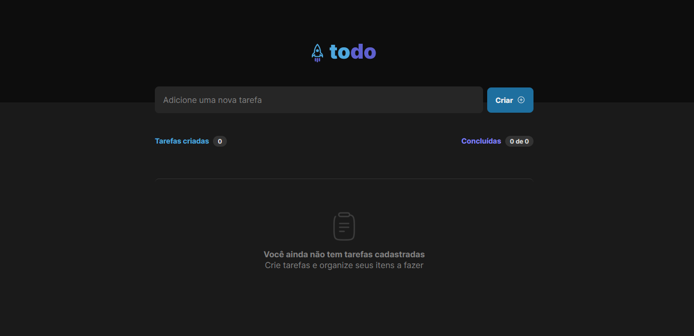
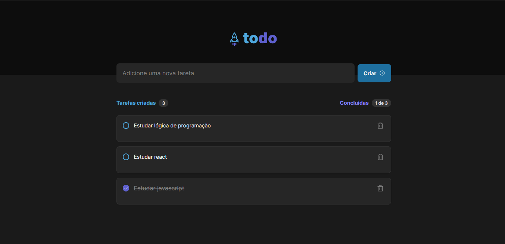

# todo

<h1 align="center"> Todo Ignite Desafio #01 </h1>

Treinando os conceitos de componentes e propriedades no react

  <a href="#-tecnologias">Tecnologias</a>&nbsp;&nbsp;&nbsp;|&nbsp;&nbsp;&nbsp;
  <a href="#-projeto">Projeto</a>&nbsp;&nbsp;&nbsp;|&nbsp;&nbsp;&nbsp;
  <a href="#-layout">Layout</a>&nbsp;&nbsp;&nbsp;|&nbsp;&nbsp;&nbsp;
  <a href="#memo-licença">Licença</a>

  

 

   

## 🚀 Tecnologias

Esse projeto foi desenvolvido com as seguintes tecnologias:

- HTML e CSS
- JavaScript
- [Node e NPM](https://nodejs.org/)
- [Vite](https://vitejs.dev/)

## 💻 Projeto

Desafio proposto pela Rocketseat para fixar os conceitos de componetização e passagem de propriedades no react.

## 🔖 Layout

Você pode visualizar o layout do projeto através [DESSE LINK](https://www.figma.com/file/GXODjA6z2hOjYD2ZUmOiqT/ToDo-List-(Copy)). É necessário ter conta no [Figma](https://figma.com) para acessá-lo.

## :memo: Licença

Esse projeto está sob a licença MIT.

---

Feito com ♥ by Carlos Eduardo V. de Oliveira :wave: [Linkedin!](https://www.linkedin.com/in/carloseduardovdeoliveira/)
